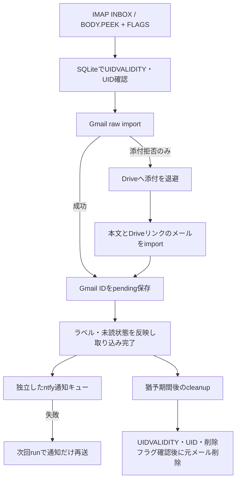

# Gmail Bridge

外部メールサーバーのIMAPメールを、Gmail APIでGmailへ取り込むPythonアプリです。Gmailの外部POP取得を利用できない環境で、会社メールなどをGmailから確認する用途を想定しています。

元の実装はQNAP NAS / Container Stationで運用確認済みです。公開版には、表示の多言語化・導入手順・秘密情報の除外・オフラインテストを追加しています。**公開版の実サービス接続とDockerビルドの確認状況は [RELEASE_NOTES.md](RELEASE_NOTES.md) を参照してください。**

[English](#english) · [導入 / Installation](INSTALL.md) · [削除 / Uninstall](UNINSTALL.md) · [トラブル対応](TROUBLESHOOTING.md) · [公開前確認](SECURITY.md)

## できること

- IMAPの `BODY.PEEK[]` で元メールを既読にせず取得。元の `\Seen` に応じて、未読メールにはGmailのUNREADラベルを付与します。
- `users.messages.import` で原文を取り込み、出所ラベルを付与。任意でSPAMラベルを解除します。
- Gmailが添付を拒否した場合だけDriveへ添付を保存し、本文とDriveリンクを含む軽量メールを取り込みます。
- SQLiteにmailbox・UIDVALIDITY・UID・Gmail IDを記録。取り込み後のラベル処理はpending状態から再開します。
- ntfy通知はメール取り込みと独立。通知が失敗してもメールを再importせず、pending通知だけを次回再送します。
- IMAP接続は最大3回試行（待機10秒、30秒）。障害通知の重複を抑え、接続復旧時に復旧通知を送ります。
- runの `flock`、日次SQLiteバックアップ、日別runログ、猶予期間を過ぎた元IMAPメールのcleanupを備えます。

## 処理の流れ



Driveの共有権限を公開に変更する処理はありません。リンクを開くにはアクセス権のあるGoogleアカウントが必要です。これは双方向同期ではなく取り込み処理で、取り込み後に元メールの既読状態が変わってもGmailへ継続同期しません。

## 最初に読むこと

1. [INSTALL.md](INSTALL.md) に従い、OAuthトークンと `config.ini` を準備します。
2. 削除・通知を無効にした設定で `init --latest 1 --dry-run` を確認します。
3. `init --latest 1` で試験取り込みし、Gmailの本文・添付・ラベル・既読状態を確認します。
4. 過去メールの扱いを選んで初期化し、常駐運用を開始します。

実設定、トークン、DB、ログ、添付やメール原文はGitHubへ置かないでください。業務メールを外部サービスへ移す場合は、所属組織の運用ルールに従ってください。

## 構成

```text
app/
  main.py                  init / run / status / cleanup
  config.py, i18n.py        設定検証・言語選択
  locales/ja.json, en.json  翻訳カタログ
  imap_client.py           STARTTLS・取得・安全な削除
  gmail_client.py          Gmail import・ラベル
  drive_client.py          Driveへの退避
  mime_fallback.py         軽量メールの組み立て
  state.py                 SQLite・通知状態・バックアップ
  notification_service.py, ntfy_client.py
  oauth.py                 共通OAuthスコープ
  service.py               コンテナ常駐ループ
make_token.py              PCのブラウザでOAuth認証
config.example.ini        秘密情報のない設定例
docker-compose.example.yml
tests/                    外部接続しない回帰テスト
tools/check_release.py    公開対象検査・配布ZIP作成
```

## 言語

既定は日本語です。`[general] language = en`、環境変数 `BRIDGE_LANGUAGE=en`、または `python -m app.main --lang en status` で変更します。優先順位はCLI、環境変数、INI、既定値です。`--lang` はサブコマンドより前に指定します。

新しい言語は `app/locales/en.json` を複製して翻訳するだけで追加できます。詳細は [CONTRIBUTING.md](CONTRIBUTING.md)。DB状態名、設定キー、メール原文、利用者が設定したラベル名は翻訳しません。外部サービス・Pythonライブラリ由来の例外は原文のままです。

## 制限

- 対象はLinuxコンテナまたはLinux上のPython 3.12。WindowsではOAuth作成・ヘルプ・オフライン検証が可能ですが、常駐運用はLinuxコンテナを使います。
- IMAPはSTARTTLS方式（通常143番）のみ。993番の暗黙TLS接続やIMAP OAuthには対応していません。
- 1つの設定・DBは1つのIMAPアカウントとGmailアカウント専用です。アカウントを変更して同じDBを使わないでください。
- Gmail側の成功とSQLiteへのID保存の間には小さなクラッシュ窓があり、厳密なexactly-once保証ではありません。Driveアップロード直後も同様です。
- UIDPLUS非対応サーバーではEXPUNGE直前に他の `\Deleted` がないことを確認しますが、他クライアントとの競合を完全には排除できません。
- runだけをロックします。init・cleanupを手動実行する際は常駐を停止し、複数コンテナで同じDBを共有しないでください。

## English

Gmail Bridge imports mail from an external IMAP mailbox through the Gmail API. The original implementation has been used on QNAP Container Station. This release adds Japanese/English catalogs, installation documentation, packaging safeguards, and offline regression tests while preserving the import and notification state machine.

Read [Installation](INSTALL.md#english), [Uninstall](UNINSTALL.md#english), [Troubleshooting](TROUBLESHOOTING.md#english), and [Release notes](RELEASE_NOTES.md) before deployment. QNAP startup and resumed imports have been reported by the owner; verify the acceptance checks for your own deployment.

Messages are fetched with `BODY.PEEK[]`. Source unread messages receive Gmail's UNREAD label; later read-state changes are not synchronized. Gmail import is followed by source labeling and an independent ntfy queue. A failed notification is retried without repeating import. An attachment rejection triggers Drive fallback: attachments go to Drive and Gmail receives a reduced message with links. Drive sharing permissions are not made public by this application.

The Linux service waits 60 seconds after each cycle, retries IMAP connections up to three times, performs successful cleanup once per local calendar date, keeps the latest 14 daily UTC database backups, and retains run logs for 30 days by modification time. Cleanup is disabled in the example configuration.

Use one IMAP account, Gmail account, and service instance per state directory. STARTTLS is required; implicit TLS on port 993 is unsupported. Pending recovery reduces duplication but cannot eliminate the window between remote success and local commit. On servers without UIDPLUS, another client's concurrent deletion can still race with EXPUNGE. Stop the service before manual init or cleanup.

Set `language = en` under `[general]` or place `--lang en` before the CLI subcommand. See [CONTRIBUTING.md](CONTRIBUTING.md) for adding translations.

## License

[MIT License](LICENSE). 著作権表記: Gmail Bridge contributors.
